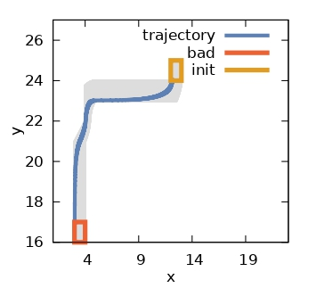
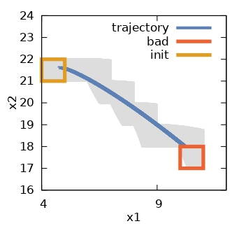

**Building SAT-Reach from source**

SAT-Reach is a Bounded verification tool for hybrid systems with piecewise affine, non-deterministics dynamics. It can generate a counterexample as a proof of safety violation.

**REQUIREMENTS**

SAT-Reach requires the following third party libraries:

1. GLPK (GNU Linear Programming Kit)

	Install the glpk-4.35 from http://ftp.gnu.org/gnu/glpk

2. Boost C++ Library

	Install boost-1.65.1 from https://www.boost.org/users/history/version_1_65_1.html

3. SUNDIALS (SUite of Nonlinear and DIfferential/ALgebraic equation Solvers)

	Install SUNDIALS-5.6.1 from https://computing.llnl.gov/projects/sundials/sundials-software

4. NLopt (Non-Linear optimization) C++ library

	Install nlopt from https://nlopt.readthedocs.io/en/latest/#download-and-installation preferably nlopt-2.6.2 

5. GMP (GNU Multiple Precision arithmetic library)

	The latest package (gmp-6.2.1) can be downloaded from https://gmplib.org

6. Z3 (Theorem Prover):  https://github.com/Z3Prover/z3

	Z3-4.8.10 can be downloaded from https://github.com/Z3Prover/z3/archive/refs/tags/z3-4.8.10.tar.gz

7. Install JDk 15 or higher from https://jdk.java.net 
	preferably JDK-15.0.1 using https://www.oracle.com/java/technologies/javase/jdk15-archive-downloads.html

8. Install plotutils : sudo apt install plotutils

Allow default installation of the library header files into the directory /usr/local/include and the .a/.so files into the directory /usr/local/lib

**INSTALLATION**

1.	After successful installation of the prerequisites as mentioned earlier go
	to the `build` directory of `SAT-Reach` repo. and run the command `sudo make all`.

	The executable `SAT-Reach` will be created in the same directory.

2. 	Install all the prerequisities automatically by running the shell script.

	chmod +x install.sh
	sudo ./install.sh

***********

  To see the help menu of the tool, run: `SAT-Reach --help`

**Running SAT-Reach**

	`./SAT-Reach -m <model_file> -c <config_file> --time-horizon=T --time-step=t --depth=k -v x1,x2 -o out.txt --CE first -F "<florbidden_symbolic_state>" -e bmc `

	Install runlim (sudo apt install runlim) for running our python scripts that runs several HA instances and stored the output in a csv file.
	
	
	
**Contacts**

	For any information, please send me an email.
	Atanu Kundu
	Email: mcsak2346@iacs.res.in

	
	
	
	

 
